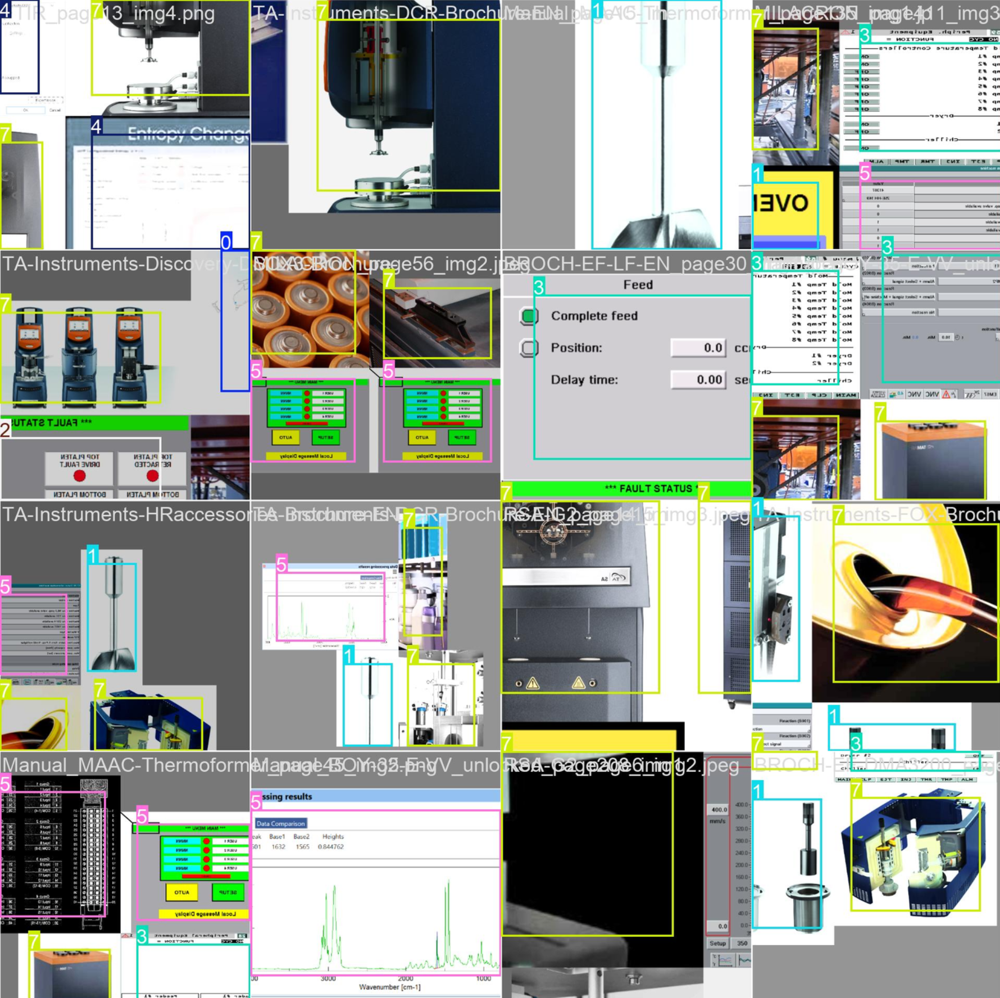

# VLM YOLO Detector

Offline vision-language data pipeline for a multimodal manufacturing assistant. This repository extracts images from equipment manuals, generates semantic descriptions via a Vision-Language Model (VLM), and produces the embedding artifacts consumed at runtime by the agentic reasoning system.

<div align="center">
  
</div>

> **Figure 1**: The system categorizes extracted images into types (diagram, schematic, photo, table, chart, ...) to support type-filtered retrieval during agent reasoning.

## Overview

This tool processes PDF manuals through a three-stage pipeline:

1. **Extract images** from PDF documents (embedded images + rendered pages with diagrams)
2. **Generate VLM descriptions** for each image using LLaVA via Ollama, which produces contextual natural-language descriptions based on page numbers and surrounding text
3. **Create semantic embeddings** (384-dimensions, sentence-transformers/all-MiniLM-L6-v2) enabling cosine-similarity image retrieval at query time
4. **Content-type classification** in which extracted images are categorized (diagram, schematic, photo, table, chart) to support type-filtered retrieval

The resulting artifacts are consumed by the agentic-rag runtime's `image_search` tool, which performs semantic matching between user queries and VLM descriptions to grab relevant technical visuals alongside textual evidence.

## Getting Started

### Prerequisites

- **Python 3.10+** with pip
- **Ollama** installed and running
- **LLaVA model** for VLM descriptions (pulled automatically by install script)

### Quick Setup (Windows)

For a fully automated installation:

```bash
git clone https://github.com/morkev/vlm-yolo-detector.git
cd vlm-yolo-detector
install.bat
```

This will:
1. Install uv package manager and Python dependencies
2. Install PyMuPDF and sentence-transformers
3. Pull the LLaVA 13B model for VLM descriptions
4. Optionally process any PDFs in data/manuals/
5. Yes, I automated the whole thing in 3 commands

### Manual Setup Steps

#### 1. Clone and Navigate

```bash
git clone https://github.com/morkev/vlm-yolo-detector.git
cd vlm-yolo-detector
```

#### 2. Install Dependencies

```bash
pip install uv
uv sync

# Or using pip directly
pip install -r requirements.txt
pip install pymupdf sentence-transformers
```

#### 3. Pull Ollama VLM Model

```bash
ollama pull hf.co/cjpais/llava-1.6-mistral-7b-gguf:Q4_K_M 
```

#### 4. Add PDF Manuals

Place your PDF files in the `data/manuals/` directory:

```bash
cp /path/to/your/manuals/*.pdf data/manuals/
```

#### 5. Run the Processing Pipeline

```bash
# Step 1: Extract images from PDFs
python scripts/extract_all_images.py --pdf-dir data/manuals --output-dir data/processed --min-size 150

# Step 2: Generate VLM descriptions (requires Ollama with llava:13b)
python scripts/describe_images_vlm.py --index data/processed/image_index.json

# Step 3: Build semantic embeddings
python scripts/build_embeddings.py
```

## Integration with Agentic RAG

- **vlm-yolo-detector**: Offline pipeline, which runs once per manual set to produce artifacts. Requires GPU-intensive VLM inference (LLaVA 13B).
- **agentic-rag**: Runtime service, loads the pre-built artifacts and serves multimodal answers via FastAPI + JavaScript frontend.

At runtime, `agentic-rag/app/backend/api/tools/image_search.py` loads the artifacts from this repo's `data/processed/` directory:

```python
IMAGE_INDEX_PATH   = "<parent>/vlm-yolo-detector/data/processed/image_index.json"
EMBEDDING_NPY_PATH = "<parent>/vlm-yolo-detector/data/processed/image_embeddings.npy"
MAPPING_PATH       = "<parent>/vlm-yolo-detector/data/processed/embedding_mapping.json"
IMAGES_DIR         = "<parent>/vlm-yolo-detector/data/processed/images/"
```

**Setup for integration:**

1. Clone this repository alongside agentic-rag in the same parent directory
2. Run `install.bat` to process PDFs and generate all artifacts
3. The agentic-rag system automatically resolves the sibling path at startup

Required directory layout:
```
Repositories/
├── agentic-rag/          # Runtime (FastAPI + frontend)
└── vlm-yolo-detector/    # Offline pipeline (this repo)
```

### Offline Transfer

The agentic-rag project includes bundle scripts that package this repo's `data/processed/` alongside other artifacts, depending on the selected mode:

```bash
powershell -ExecutionPolicy Bypass -File scripts/export_offline_bundle.ps1

powershell -ExecutionPolicy Bypass -File scripts/import_offline_bundle.ps1
```

## Processing Scripts

### extract_all_images.py

Extracts all visual content from PDFs including embedded images, vector graphics rendered as images, and full pages with diagrams.

```bash
python scripts/extract_all_images.py --pdf-dir data/manuals --output-dir data/processed --min-size 150
```

Options:
- `--pdf-dir`: Directory containing PDF files
- `--output-dir`: Output directory for extracted images
- `--min-size`: Minimum image dimension in pixels (default: 150)
- `--render-all`: Render all pages as images

### describe_images_vlm.py

Uses LLaVA via Ollama to generate contextual descriptions for each image.

```bash
python scripts/describe_images_vlm.py --index data/processed/image_index.json
```

Options:
- `--index`: Path to image_index.json
- `--batch-size`: Number of images to process in parallel (default: 5)
- `--model`: Ollama VLM model to use (default: llava:13b)

### build_embeddings.py

Creates semantic embeddings from VLM descriptions using sentence-transformers.

```bash
python scripts/build_embeddings.py
```

Options:
- `--model`: Embedding model (default: sentence-transformers/all-MiniLM-L6-v2)

## Output Files

### image_index.json

Contains metadata for each extracted image:

```json
{
  "filename": "APSX-PIM_page_5_img_1.png",
  "pdf_source": "APSX-PIM-Manual.pdf",
  "pdf_name": "APSX-PIM-Manual",
  "page": 5,
  "width": 800,
  "height": 600,
  "extraction_type": "embedded",
  "page_text": "...",
  "vlm_description": "This image shows the control panel of the APSX-PIM injection molding machine..."
}
```

### image_embeddings.npy

NumPy array of 384-dimensional embeddings for each image, indexed by filename in embedding_mapping.json.

### embedding_mapping.json

Maps image filenames to their index in the embeddings array:

```json
{
  "APSX-PIM_page_5_img_1.png": 0,
  "APSX-PIM_page_6_img_2.png": 1,
  ...
}
```


## Architecture Context

This repository implements the offline VLM data pipeline described in our research paper.


The system addresses the challenge that conventional RAG pipelines operate primarily on text, treating images as auxiliary. By pre-computing semantic descriptions and embeddings offline, the runtime agent can retrieve and reason over visual content (schematics, wiring diagrams, maintenance procedures) with the same fidelity as textual evidence.

Key design decisions:
- **LLaVA 13B** for VLM descriptions: balances quality with local inference feasibility
- **all-MiniLM-L6-v2** (384-dim) for embeddings: lightweight, fast cosine similarity
- **Content-type classification**: enables the runtime agent to filter by diagram/schematic/photo
- **Page-text grounding**: VLM descriptions incorporate surrounding page context for better semantic alignment
